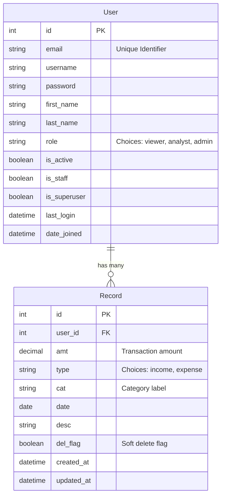
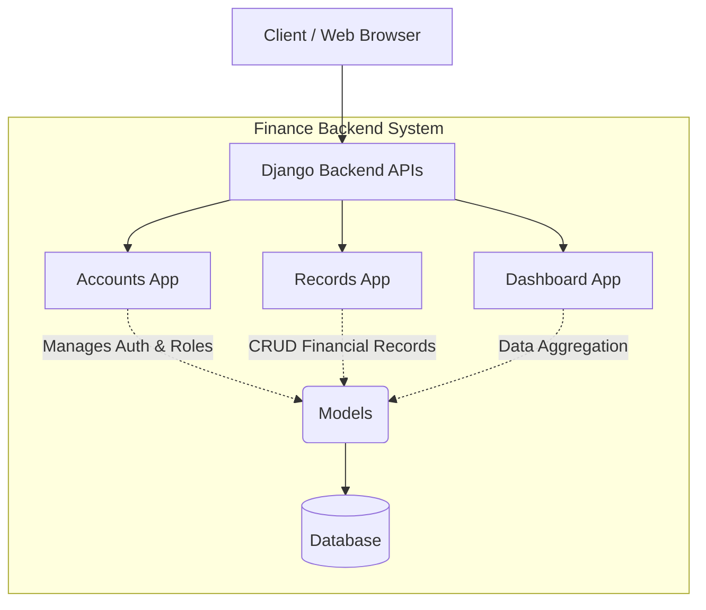
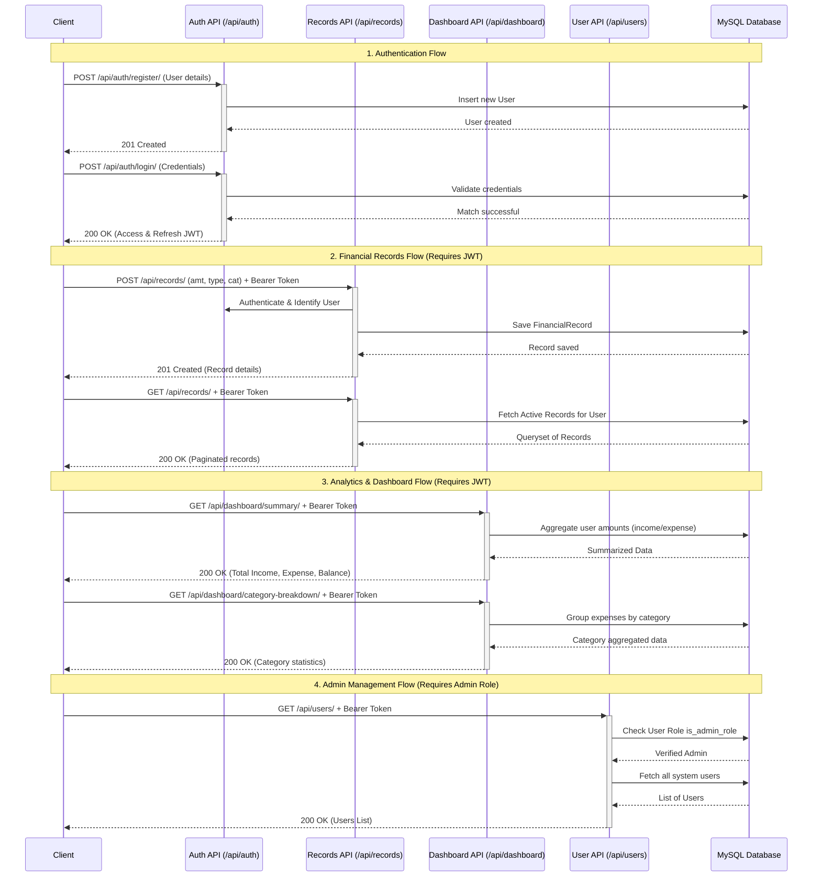
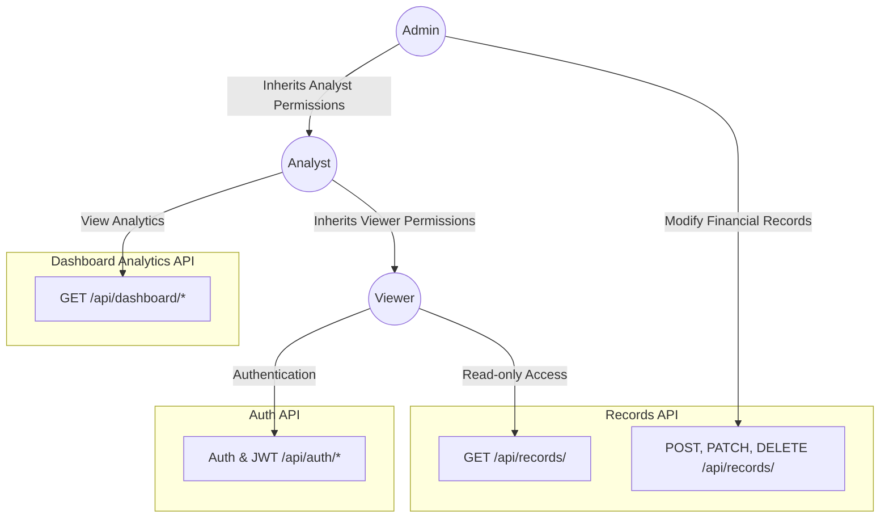

## Entity-Relationship (ER) Diagram
This diagram shows the database models and their relationships.

## High-Level Architecture
This diagram outlines the major components and the flow of the application.

## API Flow Sequence Diagram
This diagram illustrates the request-response lifecycle for typical flows: Authentication, Managing Records, Fetching Dashboard Analytics, and Admin Operations.

## Role-Based Access Control (RBAC) Flow
This matrix illustrates the permission levels defined for the three user tiers: [Viewer](file:///d:/coding/Django/accounts/permissions.py#38-43), [Analyst](file:///d:/coding/Django/accounts/permissions.py#27-36), and [Admin](file:///d:/coding/Django/accounts/permissions.py#16-25). Each role inherently inherits the permissions of the roles below it.

